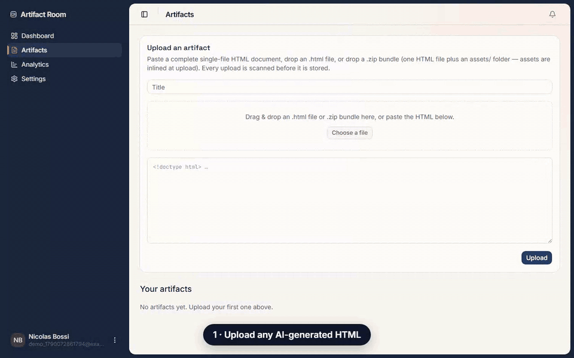

<div align="center">

# Artifact Room

_also known as **Open Artifact** — the open-source community edition_

🌐 **[artifact-room.com](https://artifact-room.com/)**

**Share freely · secure by design · meaningful insight — open source, self-hostable, provider-agnostic.**

Host AI-generated HTML artifacts (decks, prototypes, dashboards from any tool), share them with a specific external person via an unbranded link you own, and see what they actually did with it — which slide they dwelt on, whether they returned, whether they forwarded it.

[](https://github.com/nicobts/artifact-room-ce/actions/workflows/ci.yml)
[](https://github.com/nicobts/artifact-room-ce/actions/workflows/codeql.yml)
[](./LICENSE)

[Website](https://artifact-room.com/) · [Security policy](./SECURITY.md) · [Contributing](./CONTRIBUTING.md) · [Runbook](./RUNBOOK.md)

</div>

> **Status: MVP complete.** All ten core capabilities are implemented and tested (unit + integration + e2e), typecheck/lint/build green. Pre-1.0: APIs may still shift. See [what's built](#whats-built).

<p align="center">
  
</p>

<p align="center"><sub>Upload an artifact → create a per-recipient link → see which slide they dwelt on and whether they forwarded it. Recorded against a real instance; <a href="docs/launch/demo/">how it's made</a>.</sub></p>

## Why

Teams generate interactive HTML artifacts across many tools (Claude, Cursor, v0, OpenAI, …). Sharing one with an external partner or prospect is a bad choice today:

- **Provider links are branded and lock-in** — they pull your viewer into someone else's funnel, and often can't be made public at all.
- **Generic static hosts** (Netlify Drop, Pages) host the file but give you no access control and no engagement signal.
- **Nothing tells you what happened after you hit send.**

Artifact Room is **not** "a place to host HTML" — hosting is the commodity floor. It's the **share-and-watch loop**: put an artifact in a *room*, control the key (public / password / per-recipient), and watch what happens inside.

## What makes it different

Three co-equal strengths — share freely, secure by design, meaningful insight:

- **Share freely.** Paste or drop HTML from any tool; the link carries *your* brand, not the vendor's. Export and self-host — no vendor lock-in.
- **Secure by design.** Separate origin + sandboxed iframe + strict CSP + scan-on-upload. Access control is a first-class primitive: one artifact → many shares, each `public` (count-only), `recipient` (identified-without-login, the core), or `email_gated` (post-MVP), with instant revoke.
- **Meaningful insight.** Not "how many views" — *"did Jane reach the pricing slide, how long did she dwell, did she return Tuesday, did she forward it?"* Forwarding is a feature, not a bug: we detect and report it. *Per-section analytics are **experimental**: region detection is heuristic, and an artifact without section or slide markup falls back to inferring structure from scroll depth rather than reading it, so coverage is an estimate.*
- **Privacy by default.** Cookieless analytics, no raw IP at rest, EU-friendly — a selling point, not a constraint.
- **Self-hostable in one small container.** SQLite + local disk, one volume, clean upgrade paths to Postgres/S3 if you ever outgrow it.

## Architecture at a glance

Two identity systems that **never touch**:

| | Creators | Viewers |
|---|---|---|
| Identity | BetterAuth session (a real account) | An unguessable **share token** in the URL — no account, ever |
| Purpose | Upload & manage artifacts, see analytics | Be identified-without-login so analytics attribute correctly |

Everything — analytics, access control, comments — hangs off the **share**, not the artifact. Events key to `share.id`; there is no `event → artifact` path, by construction.

**Security is the load-bearing wall.** Artifact Room serves *untrusted user HTML*, so even scanned-clean uploads are served from a **separate origin**, inside a **sandboxed iframe** (opaque origin, no `allow-same-origin`), under a **strict CSP** with `connect-src 'none'` and `form-action 'none'` — the two channels that weaponize hostile HTML are shut unconditionally. Scanning is probabilistic; the sandbox is the guarantee. See [`SECURITY.md`](./SECURITY.md).

## Tech stack

Next.js (App Router, TS) · shadcn/ui + Tailwind · BetterAuth (creators only) · Drizzle ORM · SQLite (single writable container, Postgres-portable) · local-disk blob storage behind an interface · homegrown cookieless analytics · one Docker image + one volume. Backups via Litestream.

**Deliberately not in the MVP:** Supabase, Postgres, S3-as-app-storage, third-party analytics, viewer accounts, anonymous upload, provider branding. Each is a recorded decision, not an oversight.

## Quickstart

Run the published image (from [GHCR](https://github.com/nicobts/artifact-room-ce/pkgs/container/artifact-room-ce), multi-arch, one volume):

```bash
docker run -d --name artifact-room --init -p 3000:3000 \
  -e BETTER_AUTH_SECRET="$(openssl rand -base64 32)" \
  -e APP_ORIGIN=http://localhost:3000 \
  -e VIEWER_ORIGIN=http://view.localhost:3000 \
  -v artifact-data:/app/data \
  ghcr.io/nicobts/artifact-room-ce:latest
```

Production setup (two domains, TLS, backups, upgrades): **[`devops/DEPLOYMENT.md`](./devops/DEPLOYMENT.md)**.

Or build from source:

```bash
git clone https://github.com/nicobts/artifact-room-ce.git
cd artifact-room-ce
cp .env.example .env        # set BETTER_AUTH_SECRET, APP_ORIGIN, VIEWER_ORIGIN
docker compose up           # → app on app.localhost:3000, viewer on view.localhost:3000
```

Local development:

```bash
npm ci
npm run dev                 # both origins from one dev server
npm run test:unit && npm run test:integration && npm run test:e2e
```

## How it's built

Design is agreed before code: substantial changes start as an issue, not a pull
request. See [`CONTRIBUTING.md`](./CONTRIBUTING.md).

- [`prd.md`](./prd.md) — product intent, positioning, scope.
- [`docs/`](./docs/README.md) — the as-built reference: architecture, data model, security model, analytics, API.
- [`docs/05-security.md`](./docs/05-security.md) — the security model and the invariants that are never crossed.

## What's built

The ten capabilities of the core loop, in the order they were built (see the
[feature catalog](./docs/07-features.md) for per-capability status):

1. `setup-project` — single-container skeleton, two origins, storage interface, test harnesses
2. `ci-and-supply-chain` — CI pyramid, CodeQL, GHCR release with SBOM + provenance
3. `core-schema` — the data spine (`artifact / share / viewer_session / event`)
4. `creator-auth` — BetterAuth, dashboard shell
5. `artifact-upload` — authenticated ingest + scan-and-reject
6. `shares-public-and-recipient` — token create/resolve, password/expiry/revoke
7. `viewer-render-sandbox` — separate-origin sandboxed render under strict CSP
8. `analytics-engagement` — cookieless beacon, per-slide dwell, forwarding detection — *the moat*
9. `ops-hardening` — Litestream backups, health/readiness, structured logging
10. `abuse-takedown` — report intake, instant takedown, signature management

Post-MVP (schema already ready): email-gated flow, identified comments, sender notifications, then the Postgres/S3/managed-cloud track.

## Open source vs. hosted (planned)

Artifact Room's **OSS core** (the community edition, *Open Artifact*) **is a real product, not crippleware.** Self-host it and you get the full
share-and-watch loop: agnostic HTML upload, public + password + per-recipient links, per-slide dwell
and forwarding detection, and the creator dashboard — all in one container you own, cookieless, with
no raw IP at rest.

A **hosted tier is planned but not built**, and nothing here is paywalled today. When it exists it
will add team-oriented convenience — email-gated shares, identified comments, team roles / audit
logs, sender notifications, done-for-you abuse handling, custom domains — sold per-team/per-seat,
B2B. The self-hostable core stays fully functional without it. See [`prd.md`](./prd.md) §9 for the
reasoning.

> "Planned" means *not yet built*: we ship the open-source test first and gate the hosted tier on
> real demand.

## Contributing

> **⏸️ Paused.** Contributions are on hold while the Contributor Licence Agreement completes legal review, and issues are disabled for the same reason. This project is open-core — the AGPL edition and a commercial edition are built from the same code, which only works if contributions can be relicensed — and nobody should sign a CLA a lawyer hasn't read. Reading, running, self-hosting, and [security reports](./SECURITY.md) are unaffected. See [`CONTRIBUTING.md`](./CONTRIBUTING.md).

Once the review clears: read [`CONTRIBUTING.md`](./CONTRIBUTING.md) first — substantial changes start with an issue so the design can be agreed before the code exists. Be kind: [`CODE_OF_CONDUCT.md`](./CODE_OF_CONDUCT.md).

## License

[AGPL-3.0](./LICENSE) © Artifact Room contributors. Future managed/enterprise modules (`/ee`) will be separately licensed under the Functional Source License (FSL — non-compete, auto-converts to Apache-2.0 after two years).
